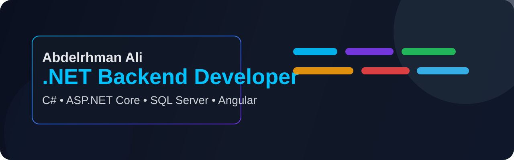
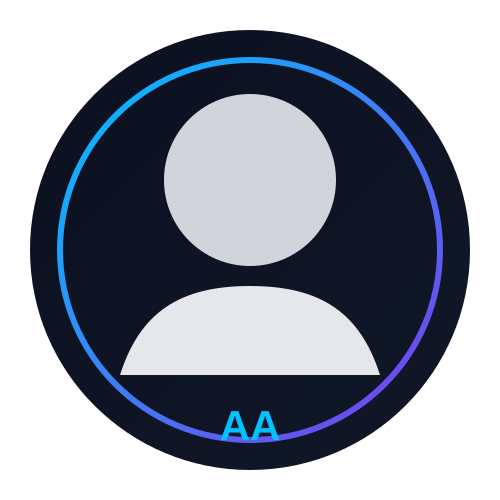
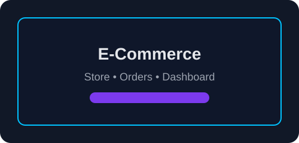
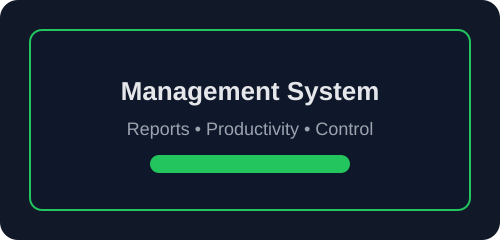
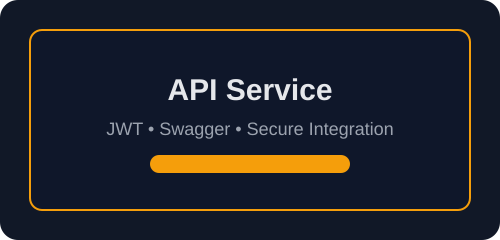
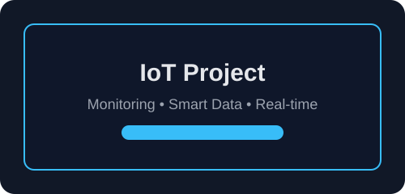
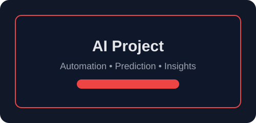
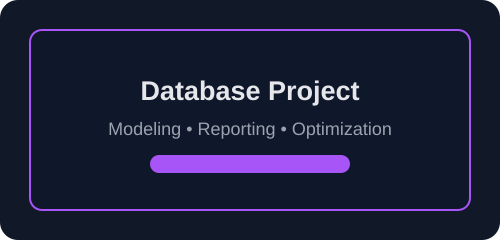

  

<h1 align="center">Hi 👋 I'm Abdelrhman Ali</h1>

  

  <strong>.NET Backend Developer</strong> | <strong>Problem Solver</strong> | <strong>Software Engineer</strong>

  I build clean backend systems, scalable APIs, and business-focused software solutions with .NET, C#, SQL, and modern engineering practices.

  

  

  <table>
    <tr>
      <td>
        
      </td>
      <td>
        <h3>Contact Me</h3>
        <b>Alexandria, Egypt</b> 
        <b>Phone:</b> +20 1559390455 
        <b>Email:</b> abdoakr72@gmail.com 
        <b>Instagram:</b> @ahmed__walid72
      </td>
    </tr>
  </table>

  
  
  
  

---

## About Me

I'm a backend-focused developer passionate about building reliable, secure, and maintainable software. I enjoy turning business needs into practical digital solutions with a strong focus on architecture, clean code, performance, and real-world impact.

- Strong interest in .NET, C#, ASP.NET Core, and backend engineering
- Focused on scalable APIs, business logic, and database-driven systems
- Interested in clean architecture, optimization, and maintainability
- Constantly learning through projects, system design, and practical engineering work

---

## Current Focus

- Building backend services with C# and ASP.NET Core
- Designing API-driven systems with strong architecture
- Improving database performance and application reliability
- Exploring software engineering best practices and scalable patterns

---

## Professional Identity

I focus on building software that is practical, reliable, and business-ready. My goal is to combine strong engineering fundamentals with a product mindset to deliver solutions that solve real problems efficiently.

- Backend-first developer mindset
- Strong problem-solving approach
- Clean code and scalable design
- Continuous learning and improvement

---

## Tech Stack

### Backend

### Frontend

### Database

### Tools & Cloud

---

## Featured Projects

| Project | Description | Stack |
|---|---|---|
|    <b>E-Commerce System</b> | Full-featured online store with orders, products, carts, and admin dashboard. | C#, ASP.NET Core, SQL Server, Angular |
|    <b>Management System</b> | Business management platform for tracking operations, users, reports, and workflows. | .NET, EF Core, SQL Server, React |
|    <b>API Project</b> | Secure and scalable backend services designed for enterprise and multi-client integrations. | ASP.NET Core, JWT, Swagger, SQL |
|    <b>IoT Project</b> | Connected device monitoring and smart data collection with real-time insights. | .NET, MQTT, APIs, Cloud |
|    <b>AI Project</b> | AI-assisted solutions focused on practical automation, recommendations, and business efficiency. | Python, C#, ML, API |
|    <b>Database Project</b> | Data modeling and reporting solution built for large-scale business requirements. | SQL, ETL, Analytics, Reporting |

### Highlights

- Clean architecture and maintainable code
- Business-oriented development mindset
- Scalable backend design and API practices
- Database optimization and practical problem solving

---

## Experience & Learning

- Backend development with .NET and ASP.NET Core
- Building business software with real-world workflows
- Learning modern architecture, clean code, and design patterns
- Growing through practical projects, implementation, and continuous improvement

---

## Certificates

- .NET & ASP.NET Core Development
- SQL Server & Database Design
- Software Engineering Fundamentals
- Full Stack Web Development Practice

> These can be replaced later with your official certificate names, dates, and issuing institutions.

---

## GitHub Statistics

  

  

  

---

## Development Workflow

  

- Solve real business problems, not just code for code's sake
- Prefer maintainable, clean, and scalable solutions
- Keep improving through hands-on building and technical learning
- Build with quality, clarity, and measurable impact in mind

---

## GitHub Streak

  

---

## Connect

  
  

---

## Final Note

I’m focused on building meaningful software, improving my engineering skills, and creating backend solutions that are practical, scalable, and valuable.

If you want to collaborate, connect, or discuss development opportunities, feel free to reach out through LinkedIn or GitHub.

